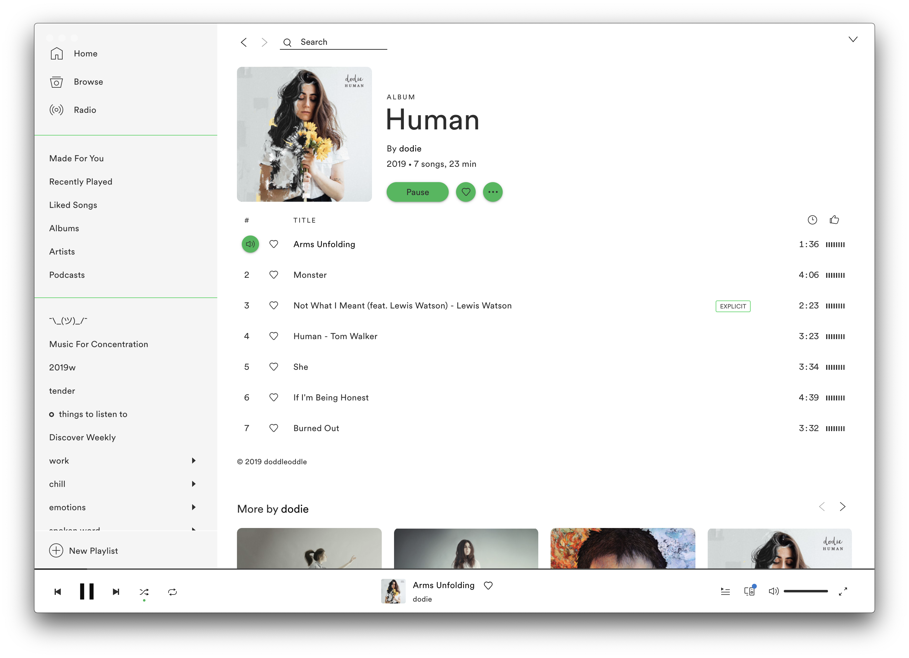
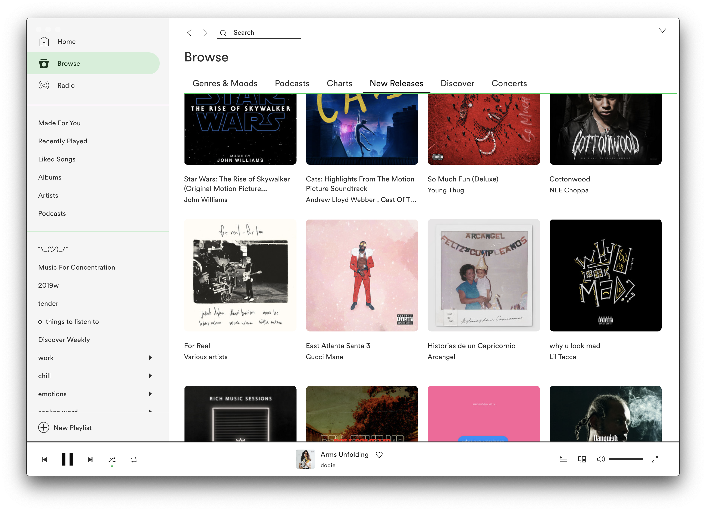
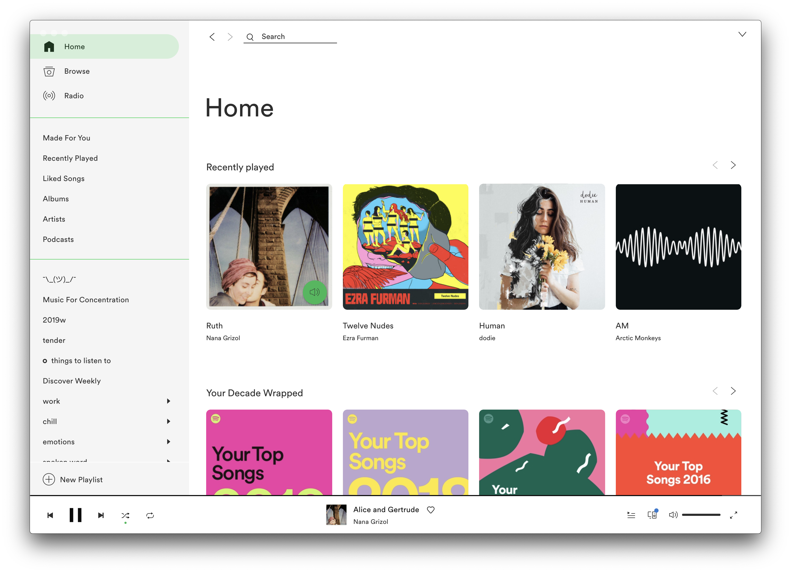

# google-spicetify: Sam's Variant
Spotify with Google style -- Sam's light theme variant
This is a Spotify theme that replicates the same feel and aesthetic of the original version with meaningful improvements to functionality and a light skin. Functionality like right-clicking and fullscreening are carefully preserved. You can follow the instructions below to install this theme. Please feel free to report issues or request changes [here](https://github.com/sdaitzman/google-spicetify).


***Sam's fork instructions***
1. [Install Spicetify](https://github.com/khanhas/spicetify-cli/wiki/Installation) (Mac `$ brew install khanhas/tap/spicetify-cli` or Windows `$ Invoke-WebRequest -UseBasicParsing "https://raw.githubusercontent.com/khanhas/spicetify-cli/master/install.ps1" | Invoke-Expression`)
2. Follow [Spicetify setup instructions](https://github.com/khanhas/spicetify-cli/wiki/Basic-Usage) (`$ spicetifty` to generate config, `$ spicetify backup apply enable-devtool` to initialize and establish a safe backup). From now on, you can run `$ spicetify update` to apply any changes you make.
3. [Download this folder as zip](https://github.com/sdaitzman/google-spicetify/archive/master.zip) and extract it
4. Copy the resulting folder to your Spicetify Themes folder (you can use `$ spicetify path` and/or [this page](https://github.com/khanhas/spicetify-cli/wiki/Customization#themes) to help find the right folder).
5. Set the following fields in your config.ini (located in the folder listed [here](https://github.com/khanhas/spicetify-cli/wiki/Customization#configs), which is right next to the Themes directory.):
```ini
current_theme    = google-spicetify
color_scheme     = SamSpotifyLight
You should modify the existing fields if applicable.
```

***Sam's version screenshots***




# EVERYTHING BELOW IS FROM ORIGINAL VERSION

## Previews
#### Base


#### Gow


#### Dark


## How to install
1. Install [spicetify-cli](https://github.com/khanhas/spicetify-cli) and make sure it applies default theme succesfully.
2. Run these commands:
  
**Linux and MacOS** in Bash:
```bash
cd "$(dirname "$(spicetify -c)")/Themes"
git clone https://github.com/khanhas/google-spicetify
```

**Windows** in Powershell:
```powershell
cd "$(spicetify -c | Split-Path)\Themes"
git clone https://github.com/khanhas/google-spicetify
```

3. Finally, run:
```
spicetify config current_theme google-spicetify
spicetify apply
```

There are 4 color schemes you can choose: `Base`, `Dark`, `Gow`, `Spotify`. Change scheme with commands:
```
spicetify config color_scheme <scheme name>
spicetify apply
```
